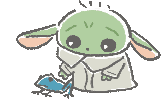

<h1 align="center">
	Hi, I'm Ruveyda
	
</h1>

 

✨ I’m currently working as a **web developer** 
 
🌱 and learning more about **React and Node.js**
 
 

&nbsp;&nbsp;&nbsp;&nbsp;&nbsp;&nbsp;&nbsp;
 

	

